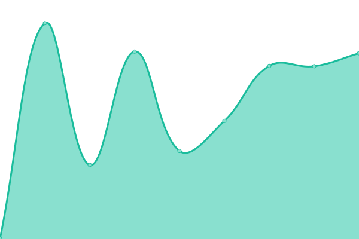

# [📈 Live Status](https://demo.upptime.js.org): <!--live status--> **🟧 Partial outage**

This repository contains the open-source uptime monitor and status page for [Sam Suite casa de software](https://www.samsuite.com.ve), powered by [Upptime](https://github.com/upptime/upptime).

With [Upptime](https://upptime.js.org), you can get your own unlimited and free uptime monitor and status page, powered entirely by a GitHub repository. We use [Issues](https://github.com/samcsval/upptime/issues) as incident reports, [Actions](https://github.com/samcsval/upptime/actions) as uptime monitors, and [Pages](https://demo.upptime.js.org) for the status page.

<!--start: status pages-->
<!-- This summary is generated by Upptime (https://github.com/upptime/upptime) -->
<!-- Do not edit this manually, your changes will be overwritten -->
<!-- prettier-ignore -->
| URL | Status | History | Response Time | Uptime |
| --- | ------ | ------- | ------------- | ------ |
|  [Sam Suite](https://samsuitecs.com) | 🟩 Up | [sam-suite.yml](https://github.com/samcsval/upptime/commits/HEAD/history/sam-suite.yml) | 

 984ms
     
 | 

<a href="https://samcsval.github.io/upptime/history/sam-suite">100.00%</a>
    

|  [Sistepago](https://sistepago.xyz) | 🟩 Up | [sistepago.yml](https://github.com/samcsval/upptime/commits/HEAD/history/sistepago.yml) | 

 492ms
     
 | 

<a href="https://samcsval.github.io/upptime/history/sistepago">100.00%</a>
    

|  [Sistepago.com](https://sistepago.com) | 🟩 Up | [sistepago-com.yml](https://github.com/samcsval/upptime/commits/HEAD/history/sistepago-com.yml) | 

 989ms
     
 | 

<a href="https://samcsval.github.io/upptime/history/sistepago-com">100.00%</a>
    

|  [El Patio de los Corotos](https://elpatiodeloscorotos.com) | 🟩 Up | [el-patio-de-los-corotos.yml](https://github.com/samcsval/upptime/commits/HEAD/history/el-patio-de-los-corotos.yml) | 

 1896ms
     
 | 

<a href="https://samcsval.github.io/upptime/history/el-patio-de-los-corotos">99.77%</a>
    

|  [Vebella soft](https://vebellasoft.net) | 🟥 Down | [vebella-soft.yml](https://github.com/samcsval/upptime/commits/HEAD/history/vebella-soft.yml) | 

 1406ms
     
 | 

<a href="https://samcsval.github.io/upptime/history/vebella-soft">100.00%</a>
    

|  [Sam Suite Libro Compras](https://lc.samsuitecs.com) | 🟩 Up | [sam-suite-libro-compras.yml](https://github.com/samcsval/upptime/commits/HEAD/history/sam-suite-libro-compras.yml) | 

 1172ms
     
 | 

<a href="https://samcsval.github.io/upptime/history/sam-suite-libro-compras">99.72%</a>
    

|  [Sam Suite Fuerza de ventas SMXII](https://smxxi.samsuitecs.com) | 🟩 Up | [sam-suite-fuerza-de-ventas-smxii.yml](https://github.com/samcsval/upptime/commits/HEAD/history/sam-suite-fuerza-de-ventas-smxii.yml) | 

 407ms
     
 | 

<a href="https://samcsval.github.io/upptime/history/sam-suite-fuerza-de-ventas-smxii">99.74%</a>
    

<!--end: status pages-->

[**Visit our status website →**](https://samcsval.github.io/upptime/)

## 📄 License

- Powered by: [Upptime](https://github.com/upptime/upptime)
- Code: [MIT](./LICENSE) © [Sam Suite casa de software](https://www.samsuite.com.ve)
- Data in the `./history` directory: [Open Database License](https://opendatacommons.org/licenses/odbl/1-0/)
